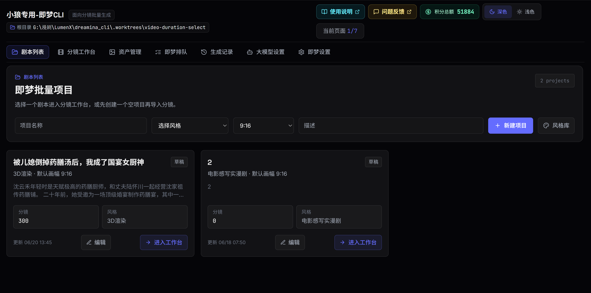
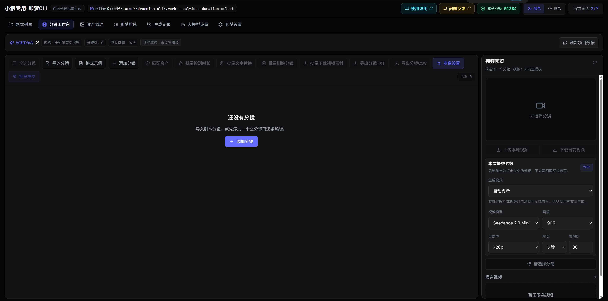
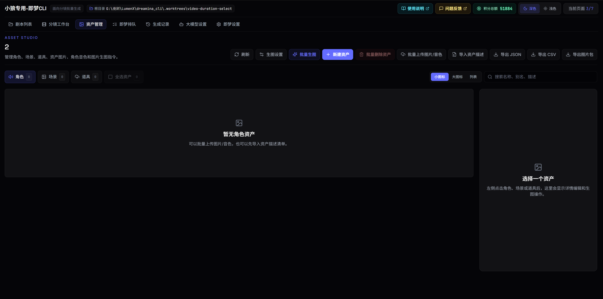
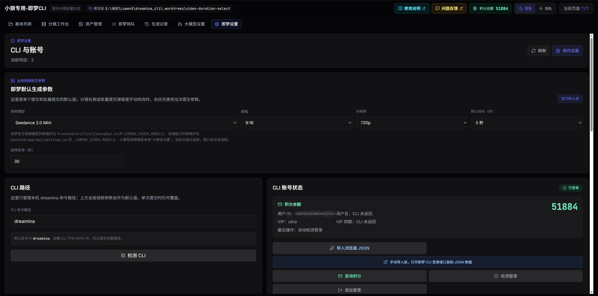
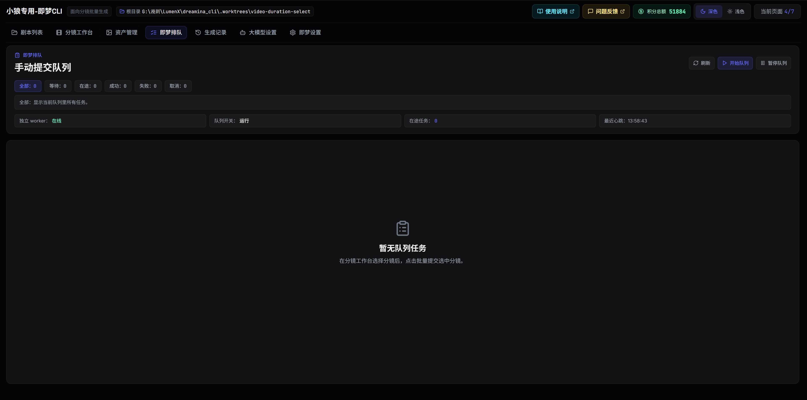
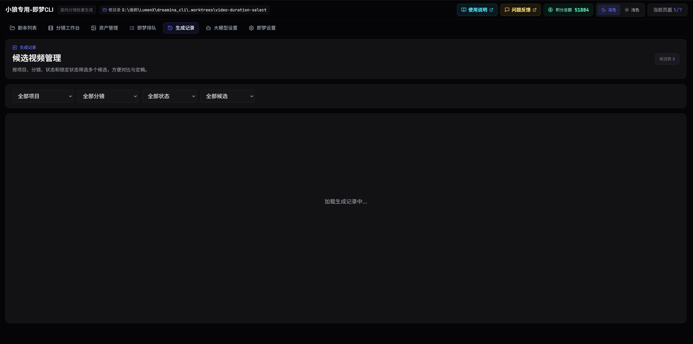

# 即梦cli自动排队助手

[](https://github.com/hyc0122/dreamina_cli#readme)

这是一个独立的即梦 CLI 自动排队助手，用于管理剧本、分镜提示词、角色/场景/道具资产、即梦 CLI 视频生成队列、候选视频回收和本地导出。

## 当前版本

- 当前版本：v1.00.055
- 更新时间：2026-06-26 12:00:00 +08:00
- 最近更新：移除不可用的即梦 API 通道，恢复官方 CLI 作为唯一视频提交通道，并补充剧本删除按钮和资产完整图预览。
- 更新日志：[CHANGELOG.md](CHANGELOG.md)
- GitHub 提交拉取说明：[docs/GitHub提交拉取说明.md](docs/GitHub提交拉取说明.md)

## 主要功能

- 剧本项目管理：创建、选择和管理多个剧本项目。
- 分镜工作台：批量导入分镜提示词、编辑分镜、移动顺序、检测默认时长。
- 资产管理：管理角色、场景、道具、角色音色，支持批量上传和同名覆盖。
- 大模型资产生图：独立“大模型设置”模块，支持通过大模型接口做资产纯文本生图。
- 资产匹配：根据分镜提示词中的角色、场景、道具名称做本地匹配和高亮。
- 即梦 CLI 队列：提交、暂停、重试、取消、持续轮询、失败跳过和候选视频回收。
- 生成记录：查看分镜视频候选、资产生成结果和大模型资产生图任务记录，支持继续获取超时任务。
- 本地导出：把选中分镜的视频复制到指定目录，并按 `分镜1.mp4`、`分镜2.mp4` 命名。
- 打包支持：提供 PowerShell 脚本将工具打包成 Windows EXE。

## 界面预览

| 剧本列表 | 分镜工作台 |
|---|---|
|  |  |

| 资产管理 | 即梦 CLI 设置 |
|---|---|
|  |  |

| 即梦排队列表 | 即梦生成视频记录 |
|---|---|
|  |  |

## 仓库地址

```text
https://github.com/hyc0122/dreamina_cli
```

## 环境要求

建议使用 Windows 环境运行。

必需环境：

- Git
- Python 3.11 或 3.12
- Node.js 20+
- npm
- PowerShell 5+ 或 PowerShell 7+

即梦生成相关：

- 需要安装并登录即梦官方 CLI。
- 如果没有安装，可在应用的“即梦设置”里使用一键安装，也可以使用官方安装命令。

```bash
curl -s https://jimeng.jianying.com/cli | bash
```

说明：

- 后端使用 FastAPI。
- 前端使用 Vite + React + TypeScript。
- 本地数据默认保存在项目运行目录下的 `runtime_data/`。

## 从 GitHub 拉取项目

1. 安装 Git 后，打开 PowerShell。

2. 选择一个工作目录，例如：

```powershell
cd D:\projects
```

3. 克隆仓库：

```powershell
git clone https://github.com/hyc0122/dreamina_cli.git
```

4. 进入项目目录：

```powershell
cd dreamina_cli
```

5. 后续更新代码：

```powershell
git pull origin main
```

开发分支提交、拉取以及 `main` 同步开发分支的完整命令，见 [GitHub 提交拉取说明](docs/GitHub提交拉取说明.md)。

## 安装 Python 依赖

在项目根目录执行：

```powershell
python -m venv .venv
.\.venv\Scripts\Activate.ps1
python -m pip install --upgrade pip
python -m pip install -r backend\requirements.txt
```

如果 PowerShell 阻止激活脚本，可以临时允许当前进程执行脚本：

```powershell
Set-ExecutionPolicy -Scope Process -ExecutionPolicy Bypass
.\.venv\Scripts\Activate.ps1
```

## 安装前端依赖

```powershell
cd frontend
npm install
cd ..
```

## 一键本地启动

推荐使用项目提供的本地启动脚本：

```powershell
.\scripts\start_local.ps1
```

脚本会启动：

- 后端 API
- 独立队列 worker
- 前端页面

默认访问地址：

```text
http://127.0.0.1:62100
```

后端健康检查：

```text
http://127.0.0.1:18177/health
```

## 手动启动

如果需要分开调试，可以分别启动。

后端 API：

```powershell
.\start_backend.ps1
```

前端：

```powershell
.\start_frontend.ps1
```

队列 worker：

```powershell
python -m backend.app.queue_worker
```

注意：如果没有启动队列 worker，加入队列的任务不会持续提交和轮询。

## 数据目录

本地运行数据默认放在：

```text
runtime_data/
```

通常包括：

- SQLite 数据库
- 上传的资产图片和音频
- 即梦生成的视频候选
- 导出结果
- 运行日志和缓存

如需自定义数据目录，可以在启动后端前设置环境变量：

```powershell
$env:DREAMINA_CLI_DATA_DIR="D:\dreamina-data"
.\start_backend.ps1
```

## 基本使用流程

1. 打开 `http://127.0.0.1:62100`。
2. 进入“即梦设置”，检查 CLI 路径。
3. 登录即梦 CLI，并确认积分可查询。
4. 进入“大模型设置”，配置资产纯文本生图使用的模型供应商和 API Key。
5. 在“剧本列表”中新建项目。
6. 进入“分镜工作台”，批量导入分镜提示词。
7. 在“资产管理”中上传或生成角色、场景、道具和音色。
8. 回到“分镜工作台”，匹配资产并检查绑定结果。
9. 设置每条分镜的视频参数，或在分镜工作台点击“批量提交”打开弹窗，确认参数、提交间隔后开始入队制作。
10. 进入“即梦排队”检查 worker 在线状态，并等待生成结果。
11. 在“生成记录”或分镜预览里查看候选视频；资产大模型生图超时后，可到“生成记录 -> 大模型生图记录”继续获取。
12. 选择默认视频后，可批量导出到指定目录。

## 大模型设置

大模型能力是独立模块，不混在即梦 CLI 设置里。

当前用途：

- 只接资产图片生成。
- 支持角色、场景、道具的纯文本生图。
- 生成结果写回资产图片字段，继续复用资产预览、绑定和管理流程。

配置入口：

```text
顶部菜单 -> 大模型设置
```

默认预留兼容 OpenAI 接口风格的供应商配置，可填写：

- API 地址
- API Key
- 默认模型
- 模型列表

## 即梦模型列表维护

后期新增即梦图片模型时，后端会从即梦 CLI 探测到的模型中增量登记：每次发现新图片模型会追加到已知列表，不会删除旧模型。

- 即梦视频模型前端列表：`frontend/src/lib/jimengApi.ts` 中的 `JIMENG_VIDEO_MODELS`。
- 即梦视频模型后端能力列表：`backend/app/api/settings.py` 中的 `_JIMENG_VIDEO_MODELS`。
- 即梦资产图片模型会经 `/jimeng/settings/cli_capabilities` 返回，前端不再维护独立图片模型常量。
- 即梦 CLI 图片模型校验允许未来 `dreaminaX.Y` / `X.Y` 版本格式，避免新模型显示后无法提交。

“大模型设置”里新增的图片模型会出现在资产管理“生图设置”的全局模型选择中；新增的视频模型会出现在分镜工作台和即梦设置的视频模型选择中。

## 即梦 CLI 设置

即梦设置只负责即梦 CLI 和视频生成相关参数：

- CLI 路径检测
- CLI 安装
- 登录/退出
- 手动导入登录 JSON
- 查询积分
- 全局视频参数
- 队列调度参数
- 视频提示词模板

手动导入登录 JSON 时，可打开官方 CLI 登录接口复制数据：

```text
https://jimeng.jianying.com/dreamina/cli/v1/dreamina_cli_login
```

## 打包成 EXE

项目提供一键打包脚本：

```powershell
.\scripts\build_exe.ps1
```

如果依赖已经安装过，可以跳过依赖安装：

```powershell
.\scripts\build_exe.ps1 -SkipNpmInstall -SkipPythonInstall
```

打包过程会生成构建缓存和发布目录，例如：

- `build_cache/`
- `frontend/dist/`
- `releases/`

## 常用脚本

```powershell
.\scripts\start_local.ps1
```

启动本地开发环境。

```powershell
.\scripts\verify_all.ps1
```

运行项目验证脚本。

```powershell
.\scripts\build_exe.ps1
```

打包 Windows EXE。

```powershell
.\scripts\clean_runtime_cache.ps1
```

清理运行缓存和构建产物。使用前请确认是否需要保留本地数据。

## 目录结构

```text
dreamina_cli/
├─ backend/                  # FastAPI 后端、存储、队列、即梦 CLI 调用
├─ frontend/                 # Vite + React 前端
├─ packaging/                # 桌面启动器和打包入口
├─ scripts/                  # 启动、验证、打包和清理脚本
├─ docs/                     # 使用说明、开发记录和设计文档
├─ README.md
├─ pyproject.toml
├─ start_backend.ps1
└─ start_frontend.ps1
```

## 更新说明

如果你是从 GitHub 拉取后继续开发，建议先阅读 [GitHub 提交拉取说明](docs/GitHub提交拉取说明.md)，按当前开发分支执行提交、拉取和同步命令。
