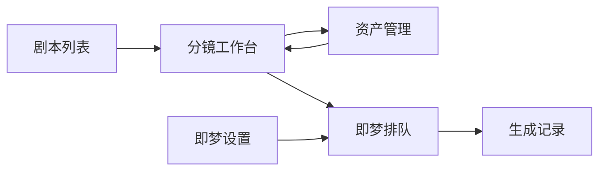
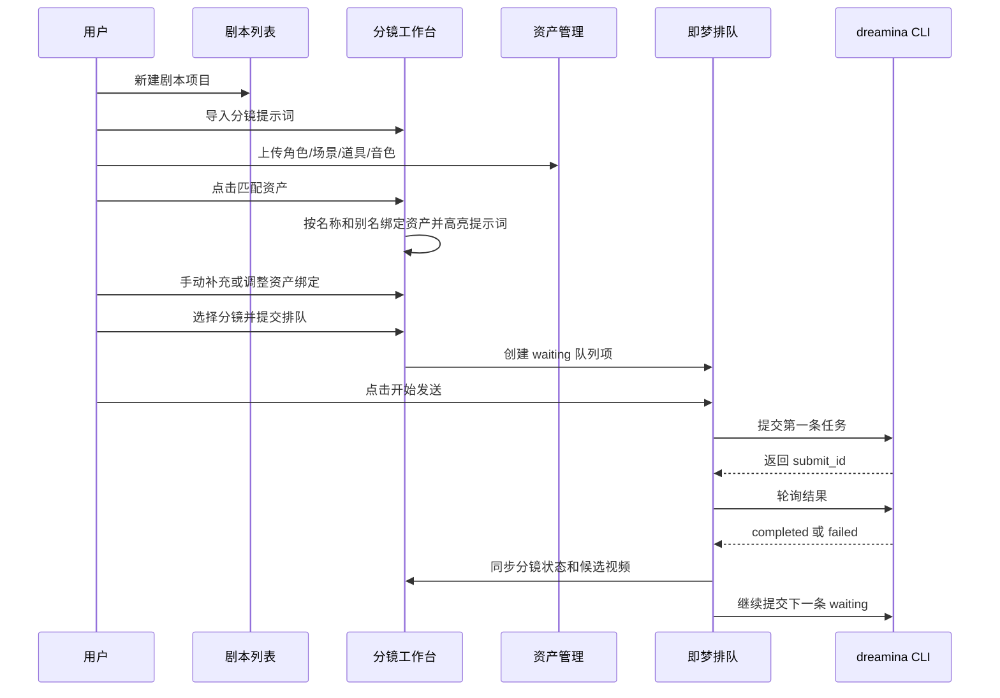

# 即梦批量生产模块开发设计文档

> 归档说明：本文档记录的是迁移到 `dreamina_cli` 独立项目之前的设计稿，内部可能保留 LumenX 集成式路径、`output/jimeng` 或旧端口描述。当前项目入口和启动方式以 `dreamina_cli/README.md` 为准。

版本：v6 布局确认版  
日期：2026-06-15  
状态：等待用户确认后进入实施计划拆分

## 0. 文档依据与限制

本开发文档依据以下信息整理：

- 用户多轮确认的功能需求与交互调整。
- 用户提供的 Genie 类分镜工作台截图，以及 v6 可视化布局确认结果。
- 当前 LumenX 项目结构与已有能力。
- 本地文档 `docs/superpowers/specs/即梦 CLI 体验指南.md` 中的 `dreamina` CLI 命令说明。
- 参考项目 `G:\漫剧\Jimeng_auto-main` 中的即梦 CLI 队列、轮询、失败跳过机制。

限制说明：

- 飞书链接 `https://bytedance.larkoffice.com/wiki/FVTwwm0bGiishxkKOoScdHR2nsg` 的正文已由用户放到本地文档，本文档以本地版本为准。
- 当前文档是开发设计文档，不直接修改业务代码。

## 1. 目标

新增一个独立的“即梦批量生产”模块，用于多剧本、多分镜、多资产的短剧/漫剧视频生成管理。

核心目标：

- 支持同时管理多个剧本项目。
- 支持批量导入分镜提示词，并在分镜工作台逐条维护资产绑定。
- 支持角色、场景、道具、角色音色的手动上传、批量导入、覆盖更新和管理。
- 根据资产管理中的名称和别名，在分镜提示词中自动识别并高亮角色、场景、道具关键词。
- 支持全局视频提示词模板，在提交给即梦时作为前置提示词拼接到每条分镜提示词前。
- 用户手动选择分镜后点击提交排队，不自动提交。
- 即梦 CLI 生成视频必须进入全局队列，按顺序一条一条发送，等待返回结果后再发送下一条。
- 失败任务自动跳过，不阻塞后续队列，并在队列页和分镜工作台中红色提示。
- 同一个分镜允许多次提交，保留多个候选视频，方便用户对比和锁定最终版。

## 2. 不做范围

当前版本不做以下能力：

- 不做配音生成。
- 不调用 AI 分析分镜中的角色、场景、道具。
- 不自动提交全部分镜。
- 不把即梦 CLI 视频生成混入现有 StoryboardR2V 页面。
- 不强制使用即梦生成资产图片，资产图片可以手动上传，也可以后续接入已有 LumenX 图片生成能力。

## 3. 当前项目分析

### 3.1 LumenX 已有能力

当前项目是 Next.js 前端加 FastAPI 后端架构，已有以下可复用能力：

- 项目、分镜、资产、视频任务等基础模型。
- 上传资产图片、保存资产变体的能力。
- 视频任务创建、状态更新、候选结果管理的基础逻辑。
- StoryboardR2V 模块中已有视频任务、右侧任务队列、预览等 UI 经验。

需要注意：

- 现有 StoryboardR2V 批量生成更偏并发提交，不适合即梦 CLI 必须排队等待的流程。
- 即梦批量生产模块应作为独立模块实现，复用底层上传、存储、静态文件访问和通用 UI 组件。

### 3.2 Jimeng_auto-main 可参考能力

参考项目的关键机制：

- 使用 `dreamina` CLI 提交任务。
- 提交后获得 `submit_id`。
- 通过 `query_result` 轮询任务状态。
- 只允许一个任务处于 running。
- 当前任务完成或失败后，再提交下一个 pending 任务。
- 失败任务记录错误信息，但不阻塞队列继续执行。

LumenX 中应复刻这个队列原则，但数据模型、接口和 UI 要融入当前项目。

### 3.3 本地即梦 CLI 指南摘要

本地 `即梦 CLI 体验指南.md` 明确给出的稳定命令：

- 安装或更新：`curl -fsSL https://jimeng.jianying.com/cli | bash`
- 登录：`dreamina login`
- 登录调试：`dreamina login --debug`
- 查询积分和登录自检：`dreamina user_credit`
- 重新登录：`dreamina relogin`
- 清除登录态：`dreamina logout`
- 文生图：`dreamina text2image`
- 文生视频：`dreamina text2video`
- 图生图：`dreamina image2image`
- 图生视频：`dreamina image2video`
- 查询异步任务：`dreamina query_result --submit_id=<submit_id>`
- 查询并下载：`dreamina query_result --submit_id=<submit_id> --download_dir=<目录>`
- 查看历史任务：`dreamina list_task`
- 按状态查看历史任务：`dreamina list_task --gen_status=success`
- 按 ID 查看历史任务：`dreamina list_task --submit_id=<submit_id>`

指南中的重要机制：

- 提交命令支持 `--poll=<秒数>`。
- `--poll` 会在提交后自动轮询，最长等待指定秒数。
- 如果等待时间内完成，终端直接输出最终结果。
- 如果等待超时，终端返回 `querying` 中间状态，并保留 `submit_id` 供后续 `query_result` 查询。
- `image2image` 的 `--images` 参数需要本地图片路径。
- `image2video` 的 `--image` 参数需要本地图片路径。
- 排查问题时需要记录执行命令、报错描述和 `~/.dreamina_cli/logs/` 下的日志。
- CLI 本地配置和任务记录位于 `~/.dreamina_cli/config.toml`、`~/.dreamina_cli/tasks.db`、`~/.dreamina_cli/logs/`。

## 4. 信息架构

顶部全局菜单包含 6 个入口：

1. 剧本列表
2. 分镜工作台
3. 资产管理
4. 即梦排队
5. 生成记录
6. 即梦设置

页面关系：



## 5. 页面设计

### 5.1 剧本列表

剧本列表是独立页面，是进入单个项目工作台的入口。

主要功能：

- 新建剧本项目。
- 查看项目名称、分镜数量、资产完整度、队列状态、成功视频数、失败任务数、最近更新时间。
- 进入分镜工作台。
- 删除项目。
- 复制项目。
- 筛选：全部、制作中、有失败、已完成。

项目卡片或列表字段：

- 项目名称
- 风格
- 分镜数量
- 角色数、场景数、道具数
- 待提交、排队中、生成中、失败、已完成数量
- 最近一次生成时间

### 5.2 分镜工作台

分镜工作台采用 v6 确认布局，整体接近 Genie 横向分镜生产表。

顶部：

- 左侧显示当前项目名、风格、分镜数。
- 中间显示批量操作区。
- 右侧显示进入即梦排队、生成记录、即梦设置的快捷入口。

批量操作按钮顺序：

1. 导入分镜
2. 格式示例
3. 添加分镜
4. 匹配资产
5. 批量文本替换
6. 批量下载视频素材
7. 批量提交选中分镜

表格列：

- 选择框
- 序号
- 分镜提示词
- 出场角色
- 场景
- 道具
- 视频
- 操作

每行能力：

- 可以选中用于批量操作。
- 可以编辑分镜提示词。
- 可以手动添加或删除当前分镜。
- 可以上移、下移调整顺序。
- 可以删除单个分镜。
- 出场角色、场景、道具列展示已绑定资产卡。
- 每个资产列末尾有 `+` 槽位，用于手动添加绑定资产。
- 视频列显示当前默认视频缩略图和状态。
- 如果生成失败，当前行红色提示，并显示失败原因入口。

右侧详情面板：

- 默认显示当前分镜的视频预览和候选视频列表。
- 点击某行资产 `+` 时，右侧临时切换为资产选择抽屉。
- 资产选择完成后，右侧回到当前分镜视频详情。
- 当前分镜可以单独提交到即梦队列。
- 候选视频支持多次生成结果对比。
- 用户可选择某个候选视频作为默认视频。
- 用户可锁定最终版视频。

分镜提示词高亮：

- 命中角色名称或别名：使用角色颜色。
- 命中场景名称或别名：使用场景颜色。
- 命中道具名称或别名：使用道具颜色。
- 高亮只基于资产名称和别名，不调用 AI。

### 5.3 资产管理

资产管理是独立页面，负责角色、场景、道具和角色音色管理。

顶部能力：

- 类型切换：角色、场景、道具。
- 搜索资产名称或别名。
- 批量导入角色。
- 批量导入场景。
- 批量导入道具。
- 新建资产。
- 显示导入格式示例。

角色资产卡：

- 角色名称。
- 角色图片。
- 别名/关键词。
- 绑定音色文件。
- 上传或替换角色图片。
- 上传或替换音色。
- 试听音色。
- 查看被哪些分镜使用。
- 删除资产。

场景资产卡：

- 场景名称。
- 场景图片。
- 别名/关键词。
- 上传或替换图片。
- 查看被哪些分镜使用。
- 删除资产。

道具资产卡：

- 道具名称。
- 道具图片。
- 别名/关键词。
- 上传或替换图片。
- 查看被哪些分镜使用。
- 删除资产。

### 5.4 即梦排队

即梦排队是全局队列页面，管理跨项目的待发送任务。

主要功能：

- 查看所有项目提交过来的队列项。
- 手动点击开始发送。
- 暂停发送。
- 继续发送。
- 取消等待中的任务。
- 失败任务重试。
- 拖拽调整等待队列顺序。
- 跳转回对应项目分镜。
- 查看 CLI 提交 ID、轮询状态、失败原因。

队列规则：

- 用户提交分镜后，只进入 waiting 队列，不自动发送。
- 用户点击开始发送后，队列开始连续处理。
- 同一时间只允许一个任务 running。
- 当前任务 completed 或 failed 后，自动进入下一条 waiting。
- 失败任务不阻塞队列。
- 失败项在队列页红色提示。
- 失败项同步到分镜工作台，对应分镜行红色提示。

### 5.5 生成记录

生成记录用于查看所有历史视频结果和失败记录。

筛选项：

- 项目
- 分镜
- 状态
- 时间范围
- 是否最终版

记录字段：

- 项目名称
- 分镜序号
- 队列任务 ID
- 即梦 submit_id
- 状态
- 生成时间
- 视频时长
- 比例
- 分辨率
- 错误信息
- 视频预览
- 下载
- 设为默认视频
- 锁定最终版

### 5.6 即梦设置

即梦设置用于配置 CLI、默认生成参数和提交给即梦前使用的全局视频提示词。

配置项：

- `dreamina` CLI 路径。
- CLI 登录状态检测。
- 打开登录指引。
- 打开登录调试指引。
- 重新登录。
- 清除登录态。
- CLI 安装或更新指令展示。
- 查询积分。
- 默认模型版本。
- 默认视频时长。
- 默认视频比例。
- 默认分辨率。
- 轮询间隔。
- 单任务最大等待时间。
- 失败重试次数。
- 失败后是否自动跳过，当前版本固定启用。
- 全局视频提示词模板。
- 当前默认启用的视频提示词模板。

检测能力：

- 检测 CLI 是否存在。
- 检测 CLI 是否可执行。
- 检测账号是否登录。
- 查询当前积分。
- 查看本地 CLI 配置文件路径。
- 查看本地任务数据库路径。
- 查看本地日志目录路径。

#### 5.6.1 全局视频提示词

全局视频提示词用于在提交每条分镜给即梦前，自动拼接到分镜提示词前面。

页面形态参考用户提供的“视频提示词”弹窗：

- 左侧分组：指令模板、我的指令。
- 我的指令支持新增不同命名的提示词，例如 `通用`、`3D国漫`、`写实短剧`。
- 右侧是提示词编辑区。
- 顶部提供变量插入按钮。
- 底部提供取消、仅保存、保存并使用。

模板内容示例：

```text
禁止出现字幕，有音效，无BGM音乐。
美术风格：{{style}}。
镜头语言：{{camera}}。
时代背景：{{era}}。
角色：{{roles}}。
场景：{{scene}}。
```

支持变量：

- `{{style}}`: 当前项目风格。
- `{{camera}}`: 当前项目或默认镜头设定。
- `{{era}}`: 当前项目时代设定。
- `{{roles}}`: 当前分镜已绑定角色名称。
- `{{scene}}`: 当前分镜已绑定场景名称。
- `{{props}}`: 当前分镜已绑定道具名称。
- `{{shot_prompt}}`: 当前分镜原始提示词。

提交给即梦时的最终提示词规则：

```text
最终提示词 = 已启用全局视频提示词渲染结果 + "\n\n" + 当前分镜提示词
```

规则说明：

- 每个项目可以选择一个默认视频提示词模板。
- 如果项目未单独选择，则使用全局默认模板。
- 如果没有启用模板，则直接使用分镜提示词。
- 队列项必须保存提交当时的前置提示词快照和最终提示词快照，后续用户修改模板不影响已入队任务。
- 模板命名由用户自定义，同名模板不允许重复。
- 变量未能解析时保留原变量文本，并在提交确认中提示。

## 6. 关键流程

### 6.1 新建项目到生成视频



### 6.2 匹配资产流程

触发方式：

- 用户在分镜工作台点击“匹配资产”。
- 用户导入新资产后，可以再次点击“匹配资产”。

匹配规则：

- 只使用资产名称和别名匹配。
- 不使用 AI 分析。
- 匹配范围是当前项目资产，后续可扩展为全局资产库。
- 同一类型内命中多个资产时，优先选择最长名称或最长别名。
- 已被用户手动锁定的绑定不被自动覆盖。
- 自动匹配结果写入分镜资产绑定表。
- 分镜提示词中命中的词自动高亮。

### 6.3 提交排队流程

用户可以：

- 提交当前分镜。
- 批量提交选中分镜。

提交前校验：

- 角色必须有关联图片。
- 场景必须有关联图片。
- 道具可以缺失。
- 如果分镜提示词中识别出道具关键词但未绑定道具，弹出确认框。
- 如果全局视频提示词中存在无法解析的变量，弹出确认提示。
- 如果 CLI 未配置，只允许入队但队列页必须提示无法开始发送。

道具缺失确认弹窗内容：

- 缺失道具名称。
- 受影响的分镜序号。
- 提示“道具可缺失，但会降低生成一致性”。
- 用户确认后才允许入队。

## 7. 数据模型设计

### 7.1 JimengProject

用途：一个剧本项目对应一个 JimengProject。

字段：

- `id`: 内部 ID。
- `name`: 项目名称。
- `style`: 风格标签。
- `prompt_preset_id`: 当前项目默认使用的视频提示词模板。
- `description`: 备注。
- `shot_count`: 分镜数量。
- `status`: 项目状态。
- `created_at`: 创建时间。
- `updated_at`: 更新时间。

项目状态：

- `draft`: 草稿。
- `working`: 制作中。
- `has_failed`: 存在失败任务。
- `completed`: 已完成。

### 7.2 JimengShot

用途：保存单个分镜提示词、顺序、状态和默认视频。

字段：

- `id`: 内部 ID。
- `project_id`: 所属项目。
- `shot_index`: 分镜序号。
- `prompt`: 分镜提示词。
- `status`: 分镜状态。
- `default_video_candidate_id`: 默认候选视频。
- `locked_video_candidate_id`: 锁定最终版视频。
- `last_error`: 最近失败原因。
- `created_at`: 创建时间。
- `updated_at`: 更新时间。

分镜状态：

- `draft`: 未提交。
- `asset_missing`: 待补资产。
- `queued`: 已入队。
- `running`: 生成中。
- `failed`: 生成失败。
- `completed`: 已完成。
- `locked`: 已锁定最终版。

### 7.3 JimengAsset

用途：保存角色、场景、道具资产。

字段：

- `id`: 内部 ID。
- `project_id`: 所属项目。
- `type`: `character`、`scene`、`prop`。
- `name`: 资产名称，也是发送给即梦时使用的名称。
- `aliases`: 别名数组。
- `image_filename`: 当前生效图片文件名，例如 `许禾.jpg`。
- `image_path`: 当前生效图片路径。
- `audio_filename`: 当前生效音色文件名，仅角色可用，例如 `许禾.mp3`。
- `audio_path`: 当前生效音色路径，仅角色可用。
- `created_at`: 创建时间。
- `updated_at`: 更新时间。

约束：

- 同一项目、同一类型内，`name` 唯一。
- 不同类型允许同名，例如角色“老张”和道具“老张名牌”可以同时存在。
- 内部 ID 可以使用 UUID，但用户可见名称、文件保存名、发送给即梦的引用名必须使用资产名称。

### 7.4 JimengAssetBinding

用途：保存分镜和资产之间的绑定关系。

字段：

- `id`: 内部 ID。
- `project_id`: 所属项目。
- `shot_id`: 分镜 ID。
- `asset_id`: 资产 ID。
- `asset_type`: 资产类型。
- `source`: `auto_match` 或 `manual`。
- `locked`: 是否手动锁定。
- `slot_order`: 同类型内排序。
- `created_at`: 创建时间。
- `updated_at`: 更新时间。

规则：

- 手动添加的资产绑定默认 `locked = true`。
- 自动匹配不会覆盖 `locked = true` 的绑定。
- 用户手动删除绑定后，该分镜应记录排除项，避免下一次匹配又自动加回。

### 7.5 JimengQueueItem

用途：保存即梦生成队列。

字段：

- `id`: 内部 ID。
- `project_id`: 项目 ID。
- `shot_id`: 分镜 ID。
- `status`: 队列状态。
- `position`: 队列顺序。
- `prompt_snapshot`: 提交时的分镜原始提示词快照。
- `prompt_preset_id`: 提交时使用的视频提示词模板 ID。
- `prefix_prompt_snapshot`: 提交时渲染后的前置提示词快照。
- `final_prompt_snapshot`: 提交给即梦的最终提示词快照。
- `asset_snapshot`: 提交时绑定资产快照。
- `cli_command`: 实际执行命令。
- `poll_seconds`: 本次提交使用的 `--poll` 秒数。
- `download_dir`: 本次结果下载目录。
- `submit_id`: 即梦返回的提交 ID。
- `gen_status`: 即梦返回的生成状态。
- `result_url`: 即梦返回的视频地址。
- `local_video_path`: 下载到本地的视频路径。
- `cli_raw_output`: CLI 原始输出摘要。
- `error_message`: 错误信息。
- `submitted_at`: 提交时间。
- `finished_at`: 完成时间。
- `created_at`: 创建时间。
- `updated_at`: 更新时间。

队列状态：

- `waiting`: 等待发送。
- `running`: 已发送并轮询中，包含 CLI 返回 `querying` 的状态。
- `completed`: 已完成。
- `failed`: 失败。
- `canceled`: 已取消。

### 7.6 JimengVideoCandidate

用途：同一分镜的多次生成结果。

字段：

- `id`: 内部 ID。
- `project_id`: 项目 ID。
- `shot_id`: 分镜 ID。
- `queue_item_id`: 来源队列项。
- `video_filename`: 本地视频文件名。
- `video_path`: 本地视频路径。
- `thumbnail_path`: 缩略图路径。
- `duration`: 时长。
- `ratio`: 比例。
- `resolution`: 分辨率。
- `source_url`: 即梦结果 URL。
- `is_default`: 是否默认展示。
- `is_locked`: 是否最终版。
- `created_at`: 创建时间。

规则：

- 每次成功生成都新增候选视频。
- 最新成功视频默认设为当前预览，除非用户已经锁定最终版。
- 锁定最终版后，再次生成不会覆盖最终版，只新增候选。

### 7.7 JimengPromptPreset

用途：保存全局视频提示词模板，用于提交即梦前拼接前置提示词。

字段：

- `id`: 内部 ID。
- `name`: 模板名称，例如 `通用`、`3D国漫`。
- `scope`: `system` 或 `user`。
- `content`: 模板正文。
- `variables`: 模板中使用到的变量列表。
- `is_default`: 是否全局默认。
- `enabled`: 是否启用。
- `created_at`: 创建时间。
- `updated_at`: 更新时间。

规则：

- `system` 模板为内置指令模板，可以复制为用户模板后编辑。
- `user` 模板为用户自定义“我的指令”。
- 同一 `scope` 下模板名称唯一。
- 同一时间只能有一个全局默认模板。
- 项目可以覆盖全局默认模板，选择自己的默认模板。
- 删除正在被项目使用的模板时，需要提示受影响项目，并要求用户重新选择或回退到全局默认。

## 8. 文件存储与命名规则

### 8.1 资产文件命名

资产文件必须以资产管理中的资产名称作为文件名主体。

示例：

- 角色图片：`许禾.png`
- 角色音色：`许禾.mp3`
- 场景图片：`老许农资.png`
- 道具图片：`文件夹.png`

禁止规则：

- 不使用随机 UUID 作为用户可见文件名。
- 不使用与资产名称无关的临时命名发送给即梦。
- 不在上传后悄悄改成无法识别的文件名。

允许规则：

- 内部数据库 ID 可以使用 UUID。
- 文件路径中可以包含项目 ID 目录，避免不同项目文件冲突。
- 文件名主体仍必须是资产名称。

建议目录：

```text
output/jimeng/projects/{project_id}/assets/characters/许禾.png
output/jimeng/projects/{project_id}/assets/characters/voices/许禾.mp3
output/jimeng/projects/{project_id}/assets/scenes/老许农资.png
output/jimeng/projects/{project_id}/assets/props/文件夹.png
output/jimeng/projects/{project_id}/videos/shot-0001/candidate-{queue_item_id}.mp4
```

### 8.2 同名覆盖规则

同一项目、同一资产类型、同一资产名称，以最后一次上传为准。

示例：

- 已有 `许禾.png`。
- 用户再次上传 `许禾.jpg`。
- 系统删除旧的 `许禾.png`。
- 数据库更新为 `许禾.jpg`。
- 前台显示 `许禾.jpg`。

音色同理：

- 已有 `许禾.mp3`。
- 用户再次上传 `许禾.wav`。
- 系统删除旧的 `许禾.mp3`。
- 数据库更新为 `许禾.wav`。
- 前台显示 `许禾.wav`。

### 8.3 文件名校验

资产名称不能包含 Windows 非法文件名字符：

```text
\ / : * ? " < > |
```

如果用户输入非法名称，前端直接提示修改，不自动转换成其他名称。

## 9. 导入格式示例

所有导入弹窗必须展示格式示例。

### 9.1 分镜纯文本导入

```text
# 1
承接：黑场 -> 老许农资店内对峙现场
场景：老许农资
人物：许禾、赵启明、监管工作人员
道具：柜台、农资货架、文件夹
分镜提示词：
0~3秒：手持跟拍，中景，35mm。赵启明嘴角下撇，指节在柜台玻璃上敲出闷响。
3~6秒：正反打，近景，85mm。许禾抬眼，瞳孔正对赵启明。

# 2
承接：上一分镜许禾话音落下 -> 店内对峙结束
场景：老许农资
人物：许禾、赵启明
道具：
分镜提示词：
0~5秒：工作人员转身出门，赵启明冷哼一声，转身拉车门。
```

解析规则：

- `# 数字` 作为分镜开始。
- `场景`、`人物`、`道具` 用于辅助显示和匹配。
- `分镜提示词` 以下内容作为主要 prompt。
- 如果没有结构字段，则整段作为 prompt 导入。

### 9.2 分镜 CSV 导入

CSV 表头：

```csv
序号,承接,场景,人物,道具,分镜提示词
1,黑场 -> 老许农资店内对峙现场,老许农资,"许禾;赵启明;监管工作人员","柜台;农资货架;文件夹","0~3秒：手持跟拍，中景，35mm。赵启明嘴角下撇。"
2,上一分镜许禾话音落下 -> 店内对峙结束,老许农资,"许禾;赵启明","","0~5秒：工作人员转身出门，赵启明冷哼一声。"
```

### 9.3 批量导入角色

方式：

- 多选图片文件。
- 文件名主体作为角色名称。
- 可同时多选音频文件，音频文件名主体和角色名称相同则自动绑定。

示例：

```text
许禾.png
许禾.mp3
赵启明.jpg
赵启明.wav
监管工作人员.png
```

结果：

- `许禾.png` 创建或覆盖角色“许禾”的图片。
- `许禾.mp3` 绑定或覆盖角色“许禾”的音色。
- `赵启明.jpg` 创建或覆盖角色“赵启明”的图片。
- `赵启明.wav` 绑定或覆盖角色“赵启明”的音色。

### 9.4 批量导入场景

示例：

```text
老许农资.png
仓库门口.jpg
村委办公室.png
```

文件名主体作为场景名称。

### 9.5 批量导入道具

示例：

```text
文件夹.png
农资货架.jpg
柜台.png
```

文件名主体作为道具名称。

## 10. 即梦 CLI 对接设计

### 10.1 CLI 封装

新增后端封装模块，建议命名：

```text
src/apps/comic_gen/jimeng_cli.py
```

职责：

- 检测 `dreamina` CLI 是否存在。
- 获取登录状态。
- 查询积分。
- 发起登录、调试登录、重新登录、清除登录态。
- 检测 CLI 命令能力和版本。
- 提交视频任务。
- 轮询视频任务。
- 下载结果视频。
- 统一解析 CLI 输出。
- 统一转换错误信息。

本地 CLI 指南确认的命令能力：

- `dreamina login`
- `dreamina login --debug`
- `dreamina relogin`
- `dreamina logout`
- `dreamina user_credit`
- `dreamina text2image`
- `dreamina text2video`
- `dreamina image2image`
- `dreamina image2video`
- `dreamina query_result`
- `dreamina list_task`

辅助规则：

- 提交命令默认带 `--poll=<秒数>`。
- `--poll` 超时返回 `querying` 时，保存 `submit_id`，后续继续用 `query_result` 查询。
- `query_result` 完成后使用 `--download_dir=<目录>` 下载结果。
- `list_task` 用于人工排查和任务对账，不作为主轮询方式。
- 未在本地指南中出现的命令，例如 `multimodal2video`，不能作为第一版必选依赖；如果本机 `dreamina -h` 或参考项目验证支持，可以作为可选能力适配。

### 10.2 提交方式

当前分镜视频生成以本地 CLI 指南里的稳定命令为准：

- 如果当前分镜已有首帧图或故事板参考图，优先使用 `dreamina image2video`。
- 如果当前分镜没有可用参考图，则使用 `dreamina text2video`。
- 如果后续检测到 CLI 支持文档未列出的多图参考视频命令，可以扩展为可选适配，但不能影响第一版稳定流程。
- 角色、场景、道具资产仍然使用资产管理中的规范名称进入最终提示词，并用于生成或选择当前分镜首帧参考图。

视频提交命令示例：

```bash
dreamina image2video \
  --image "<当前分镜首帧图路径>" \
  --prompt="<最终提示词>" \
  --duration=5 \
  --poll=30
```

```bash
dreamina text2video \
  --prompt="<最终提示词>" \
  --duration=5 \
  --ratio=16:9 \
  --video_resolution=720P \
  --poll=30
```

提交内容：

- 最终提示词，包含已启用的全局视频提示词前缀和当前分镜提示词。
- 当前分镜首帧图或故事板参考图，若有。
- 已绑定角色、场景、道具的资产名称和本地文件路径快照。
- 默认生成参数。

发送给即梦时的资产引用名称必须来自资产管理名称。

提交前需要完成提示词渲染：

- 读取项目选择的视频提示词模板。
- 如果项目未选择，则读取全局默认模板。
- 将模板变量替换为当前项目、当前分镜和当前绑定资产数据。
- 将渲染后的前置提示词与分镜提示词拼接成最终提示词。
- 将模板 ID、前置提示词快照、最终提示词快照写入队列项。
- 后续模板修改不影响已入队任务。

提交后的结果处理：

- 如果 CLI 直接返回成功结果，立即下载或保存结果视频。
- 如果 CLI 返回 `querying`，保存 `submit_id` 并保持队列项为 running。
- 后续按轮询间隔执行 `dreamina query_result --submit_id=<submit_id>`。
- 结果成功后执行 `dreamina query_result --submit_id=<submit_id> --download_dir=<当前项目下载目录>`。
- 下载目录使用项目和分镜隔离，避免不同分镜结果混在一起。

### 10.3 队列 Worker

新增队列 Worker，建议命名：

```text
src/apps/comic_gen/jimeng_queue.py
```

处理原则：

- 队列页点击开始发送后才启动。
- 每次只处理一个 waiting 队列项。
- 提交命令使用 `--poll=<秒数>`。
- 提交成功后记录 `submit_id`。
- 如果 `--poll` 直接返回成功，则直接进入下载和候选视频创建。
- 如果 `--poll` 返回 `querying`，按配置轮询间隔执行 `query_result`。
- 成功后下载视频并创建候选视频。
- 失败后记录错误，设置分镜和队列为 failed。
- 失败后自动处理下一条 waiting。
- 暂停时不提交新任务，但已 running 的任务继续轮询到结束。

### 10.4 失败处理

失败来源：

- CLI 不存在。
- CLI 未登录。
- `~/.dreamina_cli/config.toml` 缺失或配置异常。
- 积分不足。
- 提交参数错误。
- 资产文件缺失。
- 即梦合规拦截。
- 轮询超时。
- 视频下载失败。
- CLI 返回无法解析的输出。

失败后的系统行为：

- 队列项状态变为 `failed`。
- 分镜状态变为 `failed`。
- 保存 `error_message`。
- 保存 CLI 原始输出摘要。
- 提供 `~/.dreamina_cli/logs/` 日志目录入口，方便人工排查。
- 队列页红色显示。
- 分镜工作台对应行红色显示。
- 自动跳过并继续下一条 waiting。

## 11. API 设计

接口前缀建议：

```text
/jimeng
```

### 11.1 项目接口

- `GET /jimeng/projects`
- `POST /jimeng/projects`
- `GET /jimeng/projects/{project_id}`
- `PUT /jimeng/projects/{project_id}`
- `DELETE /jimeng/projects/{project_id}`
- `POST /jimeng/projects/{project_id}/duplicate`

### 11.2 分镜接口

- `GET /jimeng/projects/{project_id}/shots`
- `POST /jimeng/projects/{project_id}/shots`
- `POST /jimeng/projects/{project_id}/shots/import`
- `PUT /jimeng/projects/{project_id}/shots/{shot_id}`
- `DELETE /jimeng/projects/{project_id}/shots/{shot_id}`
- `POST /jimeng/projects/{project_id}/shots/{shot_id}/move`
- `POST /jimeng/projects/{project_id}/shots/batch_replace`
- `POST /jimeng/projects/{project_id}/shots/match_assets`

### 11.3 资产接口

- `GET /jimeng/projects/{project_id}/assets`
- `POST /jimeng/projects/{project_id}/assets`
- `POST /jimeng/projects/{project_id}/assets/batch_upload`
- `PUT /jimeng/projects/{project_id}/assets/{asset_id}`
- `DELETE /jimeng/projects/{project_id}/assets/{asset_id}`
- `POST /jimeng/projects/{project_id}/assets/{asset_id}/image`
- `POST /jimeng/projects/{project_id}/assets/{asset_id}/voice`
- `GET /jimeng/projects/{project_id}/assets/{asset_id}/voice`

### 11.4 绑定接口

- `GET /jimeng/projects/{project_id}/shots/{shot_id}/bindings`
- `POST /jimeng/projects/{project_id}/shots/{shot_id}/bindings`
- `DELETE /jimeng/projects/{project_id}/shots/{shot_id}/bindings/{binding_id}`
- `POST /jimeng/projects/{project_id}/shots/{shot_id}/bindings/reorder`

### 11.5 队列接口

- `GET /jimeng/queue`
- `POST /jimeng/queue/items`
- `POST /jimeng/queue/items/batch`
- `POST /jimeng/queue/start`
- `POST /jimeng/queue/pause`
- `POST /jimeng/queue/items/{queue_item_id}/cancel`
- `POST /jimeng/queue/items/{queue_item_id}/retry`
- `POST /jimeng/queue/reorder`

### 11.6 视频候选接口

- `GET /jimeng/projects/{project_id}/shots/{shot_id}/candidates`
- `POST /jimeng/projects/{project_id}/shots/{shot_id}/candidates/{candidate_id}/default`
- `POST /jimeng/projects/{project_id}/shots/{shot_id}/candidates/{candidate_id}/lock`
- `GET /jimeng/projects/{project_id}/shots/{shot_id}/candidates/{candidate_id}/download`
- `POST /jimeng/projects/{project_id}/shots/batch_download`

### 11.7 设置接口

- `GET /jimeng/settings`
- `PUT /jimeng/settings`
- `POST /jimeng/settings/check_cli`
- `POST /jimeng/settings/check_login`
- `POST /jimeng/settings/login`
- `POST /jimeng/settings/login_debug`
- `POST /jimeng/settings/relogin`
- `POST /jimeng/settings/logout`
- `POST /jimeng/settings/query_credit`
- `GET /jimeng/settings/cli_paths`
- `GET /jimeng/settings/cli_capabilities`

### 11.8 视频提示词接口

- `GET /jimeng/prompt_presets`
- `POST /jimeng/prompt_presets`
- `PUT /jimeng/prompt_presets/{preset_id}`
- `DELETE /jimeng/prompt_presets/{preset_id}`
- `POST /jimeng/prompt_presets/{preset_id}/default`
- `POST /jimeng/projects/{project_id}/prompt_preset`
- `POST /jimeng/projects/{project_id}/shots/{shot_id}/render_prompt_preview`

## 12. 前端模块建议

建议新增目录：

```text
frontend/src/app/jimeng/
frontend/src/components/jimeng/
frontend/src/store/jimengStore.ts
frontend/src/lib/jimengApi.ts
```

页面组件：

- `JimengProjectListPage`
- `JimengWorkbenchPage`
- `JimengAssetManagerPage`
- `JimengQueuePage`
- `JimengGenerationHistoryPage`
- `JimengSettingsPage`

核心组件：

- `JimengTopNav`
- `ShotProductionTable`
- `ShotPromptCell`
- `AssetSlotCell`
- `AssetMiniCard`
- `ShotDetailPanel`
- `AssetPickerDrawer`
- `VideoCandidateList`
- `ImportShotsModal`
- `BatchReplaceModal`
- `BatchUploadAssetsModal`
- `QueueControlBar`
- `QueueItemRow`
- `JimengSettingsForm`
- `JimengCliDiagnosticsPanel`
- `PromptPresetManager`
- `PromptPresetEditor`
- `PromptVariableToolbar`

前端状态：

- 当前项目。
- 当前选中分镜。
- 勾选分镜集合。
- 右侧面板模式：`preview` 或 `asset_picker`。
- 当前资产类型筛选。
- 队列运行状态。
- 设置检测状态。
- CLI 登录、积分、能力检测状态。
- 当前项目使用的视频提示词模板。
- 视频提示词编辑状态。

## 13. 后端模块建议

建议新增或拆分：

```text
src/apps/comic_gen/jimeng_models.py
src/apps/comic_gen/jimeng_storage.py
src/apps/comic_gen/jimeng_matching.py
src/apps/comic_gen/jimeng_prompting.py
src/apps/comic_gen/jimeng_cli.py
src/apps/comic_gen/jimeng_queue.py
src/apps/comic_gen/jimeng_api.py
```

职责：

- `jimeng_models.py`: Pydantic 模型和状态枚举。
- `jimeng_storage.py`: 项目、分镜、资产、绑定、队列、候选视频持久化。
- `jimeng_matching.py`: 名称和别名匹配、高亮范围计算。
- `jimeng_prompting.py`: 视频提示词模板管理、变量渲染、最终提示词组装。
- `jimeng_cli.py`: dreamina CLI 调用和输出解析。
- `jimeng_queue.py`: 队列 worker、轮询、失败跳过。
- `jimeng_api.py`: FastAPI 路由。

如果当前项目仍使用 JSON 文件作为轻量存储，第一版可以继续沿用项目现有存储风格。若即梦队列需要更强一致性，建议引入 SQLite 保存队列和任务状态。

## 14. 交互细节

### 14.1 手动添加资产

位置：

- 每个分镜行的角色、场景、道具列最后一个 `+` 槽位。

点击后：

- 右侧详情区域切换为资产选择抽屉。
- 抽屉顶部显示当前绑定类型。
- 支持搜索资产名称和别名。
- 支持创建新资产并上传图片。
- 角色类型支持同时上传音色。
- 选中资产后写入绑定，并回到视频预览。

### 14.2 批量提交选中

位置：

- 分镜工作台批量操作区最后一个按钮。

点击后：

- 校验选中分镜。
- 弹出提交确认。
- 展示将进入队列的分镜数量。
- 展示当前使用的视频提示词模板名称。
- 支持预览其中一条分镜的最终提示词。
- 展示缺失角色、场景、道具情况。
- 角色或场景缺失时不能提交。
- 只有道具缺失时允许确认继续。
- 提交后创建 waiting 队列项。

### 14.3 视频提示词编辑

入口：

- 即梦设置页中的“视频提示词”区域。
- 分镜工作台提交确认弹窗中的“查看/切换提示词”入口。

交互：

- 左侧展示指令模板和我的指令。
- 点击模板后右侧编辑正文。
- 点击变量按钮插入 `{{style}}`、`{{camera}}`、`{{era}}`、`{{roles}}`、`{{scene}}`、`{{props}}`、`{{shot_prompt}}`。
- 点击“仅保存”只保存模板内容。
- 点击“保存并使用”保存模板并设为当前项目默认模板。
- 当前项目默认模板在分镜工作台顶部或提交确认弹窗中可见。
- 提交确认时展示最终提示词预览，便于确认前置提示词已经生效。

### 14.4 多候选视频对比

右侧详情面板展示：

- 主预览播放器。
- 当前默认视频标记。
- 候选视频缩略图列表。
- 每个候选显示生成时间、时长、比例、分辨率、来源队列状态。
- 点击候选切换主预览。
- 点击设为默认。
- 点击锁定最终版。

### 14.5 失败红色提示

队列页：

- failed 行显示红色边框或红色状态标签。
- 展示失败原因摘要。
- 支持展开查看 CLI 原始错误。
- 支持重试。

分镜工作台：

- failed 分镜行左侧或视频列显示红色状态。
- 鼠标悬停显示失败原因。
- 点击失败标记可以跳转到生成记录或队列项。

## 15. 样式原则

LumenX 项目已有暗色、玻璃拟态、霓虹点缀的品牌方向。即梦批量生产模块需要保留 LumenX 风格，但工作台布局要借鉴 Genie 的高密度生产表。

设计要求：

- 不做营销落地页。
- 第一屏就是可用的生产工作台或项目列表。
- 分镜工作台以内容和资产缩略图为主。
- 批量按钮清晰但不喧宾夺主。
- 右侧详情面板固定，方便预览和候选对比。
- 错误状态必须明显，尤其是失败队列和失败分镜。
- 高亮颜色要能区分角色、场景、道具，但不要让提示词难读。

建议颜色语义：

- 角色高亮：蓝色系。
- 场景高亮：绿色系。
- 道具高亮：橙色系。
- 失败：红色系。
- 运行中：青色或蓝色。
- 完成：绿色。

## 16. 验收标准

### 16.1 分镜工作台

- 可以从剧本列表进入指定项目。
- 可以导入纯文本分镜。
- 可以导入 CSV 分镜。
- 可以查看格式示例。
- 可以手动新增、删除、移动分镜。
- 可以编辑分镜提示词。
- 可以选中多个分镜。
- 批量文本替换只影响选中的分镜。
- 批量下载视频素材导出选中分镜的默认视频。
- 批量提交选中分镜按钮位于批量操作区最后。
- 提示词中匹配到资产名称或别名时，不同资产类型高亮不同颜色。

### 16.2 资产管理

- 可以批量导入角色图片。
- 可以批量导入场景图片。
- 可以批量导入道具图片。
- 可以上传角色音色。
- 可以试听角色音色。
- 同一类型同名资产二次上传时，以最后一次上传为准。
- 二次上传不同扩展名时，旧文件被删除，前端显示新文件。
- 文件保存名使用资产名称。

### 16.3 队列

- 提交分镜后只进入 waiting，不自动发送。
- 点击开始发送后，队列开始处理。
- 同一时间只有一条 running。
- 当前任务结束后才提交下一条。
- 失败任务自动跳过。
- 失败任务在队列页红色提示。
- 失败任务对应分镜在工作台红色提示。
- 同一分镜多次提交会生成多个候选视频。

### 16.4 即梦设置

- 可以配置 CLI 路径。
- 可以检测 CLI 是否可执行。
- 可以检测登录状态。
- 可以查询积分。
- 可以执行登录、调试登录、重新登录、清除登录态。
- 可以展示 `config.toml`、`tasks.db`、`logs` 的本地路径。
- 可以检测本机 CLI 支持的命令能力。
- 设置缺失时，队列页不能开始发送，并给出明确提示。
- 可以新增不同命名的视频提示词模板。
- 可以保存并使用某个视频提示词模板。
- 提交分镜时最终提示词包含已启用的前置提示词。
- 队列项保存前置提示词和最终提示词快照，模板修改不影响已入队任务。

## 17. 测试建议

后端测试：

- 资产命名和覆盖规则。
- 非法资产名校验。
- 分镜文本导入解析。
- CSV 导入解析。
- 名称和别名匹配。
- 手动锁定绑定不被自动匹配覆盖。
- 角色或场景缺失时禁止提交。
- 道具缺失时返回可确认提示。
- 全局视频提示词变量渲染。
- 项目级视频提示词选择。
- 队列项保存最终提示词快照。
- `--poll` 超时后保存 `submit_id` 并继续 `query_result` 轮询。
- `query_result --download_dir` 下载到项目分镜目录。
- CLI 原始输出摘要保存到队列项。
- 队列 running 单例。
- 失败后自动跳过下一条。
- 成功后创建候选视频。

前端测试：

- v6 工作台布局在桌面宽屏下可横向浏览。
- 右侧详情面板在视频预览和资产选择之间切换正确。
- 批量操作只作用于选中分镜。
- 候选视频切换、设默认、锁定最终版逻辑正确。
- 失败状态在队列和分镜工作台同步显示。

人工联调：

- 使用 mock CLI 输出测试提交、`querying`、轮询、完成、失败。
- 使用真实 `dreamina` CLI 测试 `login`、`login --debug`、`user_credit`、`text2video`、`image2video`、`query_result`、`query_result --download_dir`、`list_task`。
- 使用一个 3 到 5 条分镜的小项目测试完整闭环。
- 使用一个 50 条以上分镜项目测试队列稳定性。

## 18. 实施拆分建议

确认本文档后，下一步建议拆成 5 个实施阶段：

1. 数据模型、存储层、API 骨架。
2. 剧本列表、分镜工作台 v6 布局和基础分镜导入。
3. 资产管理、批量导入、命名覆盖、音色上传试听、资产匹配和高亮。
4. 即梦设置、全局视频提示词、CLI 封装、队列 Worker、失败跳过和状态同步。
5. 候选视频管理、生成记录、批量下载、联调和验收测试。

## 19. 需要用户确认的边界

以下边界按当前需求已做默认设计，确认后进入开发计划：

- 资产库第一版按项目隔离，不同项目之间默认不共享资产。
- 内部数据库 ID 可以使用 UUID，但用户可见文件名、后台保存文件名和发送给即梦的资产引用名都使用资产名称。
- 角色音色只做上传、替换、试听和绑定，不参与自动配音生成。
- 匹配资产只按名称和别名，不调用 AI。
- 全局视频提示词作为前置提示词拼接到分镜提示词前面，支持多个命名模板和项目级默认模板。
- 道具缺失允许提交，但必须弹窗确认。
- 队列失败自动跳过，失败记录保留，用户可手动重试。
- 同一分镜多次生成保留多个候选视频，用户手动选择默认或锁定最终版。

## 20. 2026-06-16 即梦 CLI help 修正

本地 `dreamina -h` 与子命令 help 已确认以下事实，并覆盖旧文档中不一致的写法：

- 默认模型继续使用 `seedance2.0fast`。
- `seedance2.0mini` 按用户要求直接写入可选模型列表；当前本机 CLI help 未列出该模型，实际可用性由用户后续实测确认。
- 默认分辨率统一为 `720p`，VIP 模型可选 `1080p`；不再使用 `720P/1080P` 作为默认展示值。
- `text2video` 与 `multimodal2video` 支持画幅：`1:1`、`3:4`、`16:9`、`4:3`、`9:16`、`21:9`。
- `image2video` 的画幅由输入图片自动推断，本地适配器不再向该命令传 `--ratio`。
- 全能参考对应 CLI 命令为 `dreamina multimodal2video`。
- 全能参考本地提交前限制：图片最多 9 张、视频最多 3 段、音频最多 3 段；至少需要 1 个图片或视频；音频时长必须为 2 到 15 秒；生成视频时长为 4 到 15 秒。
