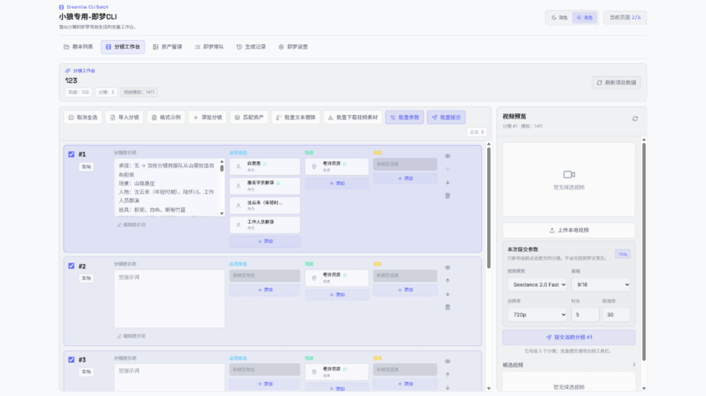
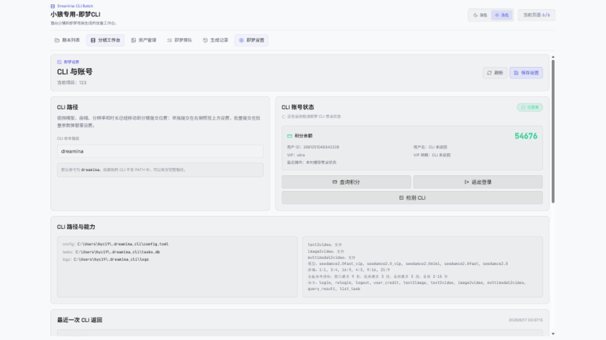

# Dreamina CLI 即梦批量生产使用说明

## 1. 启动入口

项目目录：

```text
G:\漫剧\LumenX\dreamina_cli
```

启动后端：

```powershell
cd G:\漫剧\LumenX\dreamina_cli
.\start_backend.ps1
```

启动前端：

```powershell
cd G:\漫剧\LumenX\dreamina_cli
.\start_frontend.ps1
```

打开：

```text
http://127.0.0.1:62100
```

不要再打开旧 LumenX 入口 `http://127.0.0.1:62073/#/jimeng`，那个入口已经不是独立即梦项目。

## 2. 主界面

顶部菜单固定在页面顶端，可切换：

- 剧本列表
- 分镜工作台
- 资产管理
- 即梦排队
- 生成记录
- 即梦设置

分镜工作台左侧分镜列表和右侧视频预览是分开滚动的；长分镜提示词在提示词框内部滚动，不会把整行撑到过高。



## 3. 剧本列表

在“剧本列表”中新建项目，填写：

- 项目名称
- 风格
- 默认画幅比例，默认 `9:16`
- 描述

项目创建后可以继续编辑名称、风格、默认画幅比例和描述。点击“进入工作台”后进入该剧本的分镜工作台。默认画幅比例是该剧本提交分镜视频时的默认值，不需要每条分镜单独设置；如果某次单独提交或批量提交临时改了画幅，只影响那次队列任务。

“风格”来自剧本列表里的“风格库”。风格库保存在后端数据库中，每条风格包含“风格名字”和“风格提示词”：风格名字用于下拉选择和管理，风格提示词才会在生成视频时发送给即梦等大模型。创建或编辑剧本时选择的是风格名字；全局视频生成模板里的 `{{style}}` 会渲染成该风格名字对应的风格提示词。如果旧项目里的风格名字在风格库中找不到，系统会回退使用项目里保存的原始风格文本。

## 4. 导入分镜

进入“分镜工作台”后点击“导入分镜”。推荐格式：

```text
#1
分镜提示词内容

#2
分镜提示词内容
```

也可以使用纯文本，每个空行分隔一条分镜。导入后可以：

- 手动新增分镜
- 删除单个分镜
- 上移/下移分镜顺序
- 点击“编辑提示词”或双击提示词框编辑
- 批量文本替换选中分镜里的提示词文本

## 5. 资产管理

资产类型包括：

- 角色
- 场景
- 道具

角色可以额外上传音色文件。命名规则以资产管理中的名称为准：

```text
许禾.png
许禾.mp3
老许农资.png
```

同类型同名资产以后一次上传为准。例如先上传 `许禾.png`，再上传 `许禾.jpg`，后台会移除旧图片并显示 `许禾.jpg`；音色同理。

资产详情支持：

- 图片预览和放大预览
- 本地上传图片
- 新建资产时直接上传图片；新建角色时还可以同时选择音色文件
- 修改文件/资产名称
- 修改详情描述，也就是资产生图提示词
- 选择生图模型
- 选择资产画幅，默认 `16:9`
- 生图设置中的默认资产画幅、全局必填提示词、类型前缀和分辨率
- 单个资产生图和批量生图
- 导入/导出资产描述
- 导出资产图片

资产图片生图当前接即梦 CLI 的 Dreamina 系列模型选项：Dreamina 4.0、4.1、4.5、4.6、5.0。

## 6. 匹配和绑定资产

在“分镜工作台”点击“匹配资产”，系统会按资产名称和别名做关键词匹配，不使用 AI 分析。

命中的文字会在分镜提示词中高亮：

- 角色：蓝色系
- 场景：绿色系
- 道具：黄色系

每个分镜可以手动添加或移除角色、场景、道具。点击已绑定资产会打开右侧资产选择面板，方便继续调整。

如果角色上传了音色，角色卡片旁会显示亮色小喇叭。点击小喇叭可以针对当前分镜关闭/开启该角色音色参考；这个开关会保存到分镜资产绑定，并影响后续提交到即梦队列的全能参考快照。旁边的管理按钮可以打开该角色资产继续维护图片、音色和描述。

## 7. 提交到即梦

### 单独提交

点击某个分镜卡片后，右侧会显示该分镜视频预览和提交按钮。即使没有勾选该分镜，也可以直接点击“提交当前分镜”。

提交按钮上方有“本次提交参数”：

- 生成模式，默认“自动判断”
- 视频模型，默认 `Seedance 2.0 Fast`
- 画幅，默认读取当前剧本的默认画幅比例
- 分辨率，默认 `720p`
- 时长，默认 `5`
- 轮询秒，默认 `30`

这些参数只影响本次提交，会随队列项保存，不会写回即梦设置页。

生成模式的含义：

- 自动判断：有有效角色、场景、道具图片或附加视频时自动使用全能参考，否则使用纯文本生成。
- 全能参考：强制使用 `multimodal2video`；缺少图片或视频时不允许提交。
- 纯文本生成：只发送最终提示词，不上传任何绑定素材。

### 批量提交

点击“全选分镜”或手动勾选多个分镜，再点击“批量参数”或“批量提交”。弹窗里确认本次批量生成参数后，系统会把选中分镜写入队列。

角色和场景是提交前必需项。道具可以缺失，但会弹窗确认。

## 8. 即梦排队

提交后进入“即梦排队”页面：

- 手动开始队列
- 暂停队列
- 取消任务
- 重试失败任务
- 调整排队顺序
- 查看独立 worker 在线状态、最近心跳和当前在途任务数

队列由独立 worker 进程执行。任务提交成功进入轮询后，worker 不会等待该视频回传才提交下一条；它会在“最大在途任务”范围内按提交间隔继续提交，同时定期轮询所有未完成任务。关闭网页不会停止 worker，只有停止本地服务或 worker 进程才会停止。

“即梦设置 -> 队列调度”可以修改：

- 提交间隔：默认 3 秒。
- 最大在途任务：默认 10 条。
- 结果轮询间隔：默认 30 秒。
- 最大重试次数和重试退避基数。

队列满、限流、服务忙和暂时网络错误会退避重试；未登录、积分不足会进入阻塞状态；参数错误会直接失败。失败任务会标红，worker 会继续处理下一条，不会卡住整个队列。

## 9. 视频结果管理

同一个分镜可以多次提交，得到多个候选视频。候选视频可以：

- 在分镜右侧预览对比
- 设置默认视频
- 锁定视频
- 下载单个候选
- 批量下载每个分镜默认视频素材
- 上传本地视频作为候选

本地上传的视频也会进入候选视频列表，和即梦生成结果一起管理。

单个下载会弹出系统文件夹选择窗口，文件名固定为 `分镜N.mp4`。批量下载也会先选择目标文件夹，然后自动新建“剧本名+年月日时分”目录，并按 `分镜1.mp4`、`分镜2.mp4` 保存选中分镜的默认视频。

## 10. 即梦设置

“即梦设置”主要管理 CLI 路径、单个官方 CLI 登录状态、积分、队列调度和模板。



已登录时只显示必要按钮：

- 查询积分
- 退出登录
- 检测 CLI

未登录时显示：

- 检测登录
- 登录
- 重新登录
- 调试登录
- 检测 CLI

登录时会自动打开即梦 OAuth 授权页面。你在即梦页面确认后，本页面会轮询登录结果并自动刷新积分。

## 11. 全局视频生成模板和图片指令模板

全局视频生成模板在“即梦设置”页面下方。它只用于分镜视频生成：提交分镜到即梦队列时，系统先把模板渲染成前置指令，再拼接分镜提示词。

可用变量：

```text
{{style}}
{{camera}}
{{era}}
{{roles}}
{{scene}}
{{props}}
{{shot_prompt}}
```

变量来源：

- `{{style}}`：当前剧本选择的风格对应的“风格提示词”，来自“剧本列表 -> 风格库”。风格名字只是管理名，不直接作为最终风格提示词发送，除非找不到对应风格记录。
- `{{camera}}`：提示词预览或提交参数里的镜头语言；未填写时为空。
- `{{era}}`：提示词预览或提交参数里的时代背景；未填写时为空。
- `{{roles}}`：当前分镜已绑定的角色资产名称和描述。
- `{{scene}}`：当前分镜已绑定的场景资产名称和描述。
- `{{props}}`：当前分镜已绑定的道具资产名称和描述。
- `{{shot_prompt}}`：当前分镜自己的分镜提示词。

“仅保存”只保存模板；“保存并使用”会绑定到当前剧本。绑定后可在分镜工作台顶部看到当前视频模板名称。

全局必填提示词在“资产管理”的生图设置里，只用于角色、场景、道具生图。它不会参与分镜视频生成，所以不和全局视频生成模板冲突。它是有关联的：单个资产生图和批量资产生图都会把“对应类型前缀 + 全局必填提示词”作为 `extra_prompt` 发给后端，后端再和资产详情描述、资产参数配置组成最终 text2image 提示词。

## 11.1 提交给即梦的参数说明

### 资产生图

资产管理里点击“AI 生图”或“批量生图”时，系统会先保存资产详情，再调用即梦图片模型。发送内容为：

```text
对应类型前缀 + 全局必填提示词 + 资产详情描述/生图提示词 + 资产参数配置
```

其中对应类型前缀分别来自“资产管理 -> 生图设置”：

- 人物提示词前缀：只用于角色资产。
- 场景提示词前缀：只用于场景资产。
- 道具提示词前缀：只用于道具资产。

对应类型前缀的意思是：同一套图片指令模板之外，再给不同资产类型一段专属约束。角色通常强调五官、服装、发型稳定；场景强调空间结构、光线、背景可复用；道具强调单体清晰、材质细节和干净背景。这样角色、场景、道具不会都套同一种生图要求。

资产管理有独立的默认资产画幅，默认 `16:9`，只影响新建资产和批量文件上传创建出来的资产；它和剧本的默认视频画幅是两套设置，互不影响。分辨率在资产详情面板右侧，与生图模型、画幅放在同一行设置；生图设置弹窗里只编辑默认资产画幅、全局必填提示词和三类前缀，不再放分辨率，避免同一个参数出现在两个位置。生图设置里也可以选择风格库中的风格，系统会把该风格的“风格提示词”附加到全局必填提示词编辑框中；这个动作只读取风格库内容，不会修改风格库本身。

同时发送的图片生成参数包括：

- 资产名称：用于本地保存文件名，例如 `许禾.png`。
- 生图模型：Dreamina 4.0、4.1、4.5、4.6、4.7、5.0。
- 资产画幅：`16:9` 或 `9:16`，新建资产默认读取资产管理的默认资产画幅。
- 分辨率类型：资产详情面板里的 `2k` 或 `4k`。
- 轮询时间：使用默认或生图请求里的 `poll_seconds`。

### 分镜生成视频

分镜工作台提交单个分镜或批量提交时，系统会创建队列项。每个队列项保存一份快照，避免后续修改资产或模板影响已排队任务。发送内容为：

```text
全局视频生成模板渲染结果 + 分镜提示词 + 出场角色 + 场景 + 道具
```

如果角色资产上传了音色，角色卡片旁会显示小喇叭。小喇叭用于单个分镜关闭/开启该角色音色参考，旁边的管理按钮用于打开资产管理或资产选择面板继续维护音色文件。关闭后，该角色仍会作为图片参考进入快照，但不会携带 `audio_path`。音频作为全能参考使用时需要遵守即梦 CLI 限制：音频最多 3 段，每段 2-15 秒。

同时发送的视频生成参数包括：

- 视频模型：默认 `seedance2.0fast`，也可选 `seedance2.0mini` 等。
- 画幅：默认读取当前剧本默认画幅；单次提交或批量提交弹窗里可临时覆盖。
- 分辨率：默认 `720p`。
- 时长：优先读取分镜自己的默认时长；如果没有，则使用本次提交参数里的时长。
- 轮询秒：默认 `30`。
- 全能参考限制：图片最多 9 张、视频最多 3 段、音频最多 3 段；至少需要 1 张图片或 1 段视频。

全能参考会按“角色图片 -> 场景图片 -> 道具图片 -> 附加图片”的顺序上传，并在最终提示词前增加对应关系。例如：

```text
【参考素材对应关系】
图片1：角色“沈云禾（年轻时期）”
图片2：角色“陆怀川”
图片3：场景“山路悬崖”
图片4：道具“白布担架”
音频1：角色“沈云禾（年轻时期）”的音色

原分镜最终提示词……
```

官方 CLI 指南没有规定必须使用 `@图片1` 语法，因此本工具不添加未经官方说明确认的 `@` 标记。图片、视频、音频通过重复的 CLI 文件参数发送，提示词中的编号与参数顺序保持一致：

```bash
dreamina multimodal2video \
  --image "沈云禾（年轻时期）.png" \
  --image "陆怀川.png" \
  --image "山路悬崖.png" \
  --image "白布担架.png" \
  --audio "沈云禾（年轻时期）.mp3" \
  --prompt="【参考素材对应关系】图片1：角色沈云禾……" \
  --model_version=seedance2.0fast \
  --duration=10 \
  --ratio=16:9 \
  --video_resolution=720p \
  --poll=3
```

## 12. 缓存和文件保存位置

默认数据根目录：

```text
G:\漫剧\LumenX\dreamina_cli\runtime_data
```

如果启动后端前设置了环境变量，则使用你指定的目录：

```powershell
$env:DREAMINA_CLI_DATA_DIR="D:\your\data\dir"
```

默认文件位置：

```text
G:\漫剧\LumenX\dreamina_cli\runtime_data\jimeng.sqlite3
G:\漫剧\LumenX\dreamina_cli\runtime_data\output
```

详细目录：

```text
runtime_data\jimeng.sqlite3
runtime_data\output\jimeng\projects\<project_id>
runtime_data\output\jimeng\projects\<project_id>\assets\characters
runtime_data\output\jimeng\projects\<project_id>\assets\characters\voices
runtime_data\output\jimeng\projects\<project_id>\assets\scenes
runtime_data\output\jimeng\projects\<project_id>\assets\props
runtime_data\output\jimeng\projects\<project_id>\assets\<type>\.generated
runtime_data\output\jimeng\projects\<project_id>\videos\<queue_item_id>
runtime_data\output\jimeng\projects\<project_id>\videos\uploads\<shot_id>
```

说明：

- `jimeng.sqlite3` 保存项目、分镜、资产、绑定、队列、候选视频记录。
- `assets\characters` 保存角色图片。
- `assets\characters\voices` 保存角色音色。
- `assets\scenes` 保存场景图片。
- `assets\props` 保存道具图片。
- `.generated` 保存资产生图时即梦返回的临时生成图。
- `videos\<queue_item_id>` 保存即梦生成视频下载结果。
- `videos\uploads\<shot_id>` 保存你手动上传到分镜的视频候选。
- 后端通过 `/files/...` 和 `/files/jimeng/...` 提供本地预览访问。

## 13. 即梦 CLI 安装

官方安装命令：

```bash
curl -s https://jimeng.jianying.com/cli | bash
```

安装后在“即梦设置”里执行“检测 CLI”。如果检测失败，可以点击“一键安装 CLI”，系统会调用官方安装命令：

```bash
bash -lc "curl -s https://jimeng.jianying.com/cli | bash"
```

如果电脑没有 Bash 或 Git Bash，请先安装 Git for Windows，或者按官方命令手动安装 CLI。安装后也可以把完整 CLI 路径填到“CLI 命令路径”。

## 13.1 登录和积分

稳定版只使用当前 Windows 用户下的一个官方即梦 CLI 登录态。登录凭证由官方 CLI 管理，通常位于 `%USERPROFILE%\.dreamina_cli`。本工具提供登录授权、手动导入官方登录 JSON、检测登录、查询积分和退出登录，不再切换实验性多账号 profile。

## 14. 打包成 EXE

当前项目是前后端分离结构，推荐先用 one-folder 方式打包，便于保留 CLI、数据库和生成文件。

### 14.1 构建前端

```powershell
cd G:\漫剧\LumenX\dreamina_cli\frontend
npm install
npm run build
```

构建结果在：

```text
G:\漫剧\LumenX\dreamina_cli\frontend\dist
```

### 14.2 安装后端依赖和 PyInstaller

```powershell
cd G:\漫剧\LumenX\dreamina_cli
python -m pip install -r backend\requirements.txt
python -m pip install pyinstaller
```

### 14.3 一键打包脚本

项目已经提供桌面启动器和一键打包脚本：

```powershell
cd G:\漫剧\LumenX\dreamina_cli
.\scripts\build_exe.ps1 -AppName "即梦cli批量工具"
```

脚本默认会使用 `build_exe\.venv` 隔离构建环境，避免把当前电脑全局 Python 环境里的 torch、transformers、pandas 等无关包打进程序。

如果前端依赖已经安装，可以跳过 npm install：

```powershell
.\scripts\build_exe.ps1 -AppName "即梦cli批量工具" -SkipNpmInstall
```

如果 Python 依赖和 PyInstaller 已安装，也可以同时跳过 Python 依赖安装：

```powershell
.\scripts\build_exe.ps1 -AppName "即梦cli批量工具" -SkipNpmInstall -SkipPythonInstall
```

如果你明确想使用当前 Python 环境打包，可以加：

```powershell
.\scripts\build_exe.ps1 -AppName "即梦cli批量工具" -UseCurrentPython
```

打包结果：

```text
G:\漫剧\LumenX\dreamina_cli\dist_exe\即梦cli批量工具\即梦cli批量工具.exe
```

运行方式：

1. 双击 `即梦cli批量工具.exe`。
2. 程序会启动本地服务并自动打开 `http://127.0.0.1:62100`。
3. EXE 同级会自动创建 `data` 目录，用来保存数据库、上传资产、生成视频、账号 profile 和缓存文件。

注意事项：

- 即梦 CLI 本身不建议塞进 EXE，保持系统已安装的 `dreamina` 命令即可。
- 升级程序时不要删除 EXE 同级的 `data` 目录，否则项目、缓存和账号登录状态会丢失。
- 如果打包时中文文件名在终端显示异常，可以临时使用英文名称测试：`-AppName "DreaminaCliBatch"`。

## 15. 本轮新增功能说明

### 15.0 界面截图

分镜工作台示例：


即梦设置示例：


### 15.1 浅色/深色弹窗

弹窗已经跟随浅色/深色主题切换。按 `Esc` 或点击空白区域可以关闭弹窗；如果弹窗里有未保存修改，会提示是否放弃。

### 15.2 分镜时长检测

分镜工作台每条分镜后面有默认时长设置。点击“检测”后，系统会从分镜提示词中识别类似这些内容：

```text
总时长：15秒
时长 8 秒
duration: 6s
```

识别成功后会写入该分镜默认时长。提交队列时，单条分镜默认时长优先于批量提交里的通用时长。

### 15.3 资产图片指令前缀

资产管理的“生图设置”里有一个全局必填提示词，以及三套可切换编辑的前缀：

- 人物提示词前缀
- 场景提示词前缀
- 道具提示词前缀

全局必填提示词和下方专属前缀都会发给大模型。三个前缀按钮在同一排，点击后共用下方的大编辑框。资产生图时会按资产类型自动选择对应前缀。实际发送给即梦图片模型的顺序是：

```text
对应类型图片指令前缀 + 全局必填提示词 + 资产详情描述/生图提示词 + 资产参数配置
```

它只用于角色、场景、道具图片生成，不参与分镜视频生成。分镜视频生成仍然使用“即梦设置”里的全局视频生成模板。

## 16. 缓存、数据和构建目录

开发环境默认数据目录：

```text
G:\漫剧\LumenX\dreamina_cli\runtime_data
```

EXE 运行环境默认数据目录：

```text
即梦cli批量工具.exe 同级目录\data
```

常见文件位置：

- SQLite 数据库：`runtime_data\jimeng.sqlite3` 或 EXE 同级 `data\jimeng.sqlite3`
- 项目图片、音色、视频：`runtime_data\output\jimeng\projects`
- 桌面启动日志：EXE 同级 `data\logs\desktop.log`
- 前端构建结果：`frontend\dist`
- 打包临时缓存：`build_cache`
- 发布产物：`releases`

清理开发缓存可以运行：

```powershell
.\scripts\clean_runtime_cache.ps1
```

如果连发布包也要清理：

```powershell
.\scripts\clean_runtime_cache.ps1 -IncludeReleases
```

## 17. 即梦 CLI 返回结果说明

系统会保存即梦 CLI 的原始返回 `raw_output`，用于排查登录、积分、生成和下载问题。

登录常见字段：

- `verification_uri` / `result_url`：需要打开完成授权的网页。
- `user_code`：授权码。
- `device_code`：设备授权码。
- `poll_interval`：轮询间隔。
- `expires_at`：授权过期时间。

积分常见字段：

- `total_credit` / `credit` / `balance`：积分余额。
- `user_id`：账号 ID。
- `user_name` / `nickname`：用户名。如果 CLI 没返回，界面会显示“CLI 未返回”。
- `vip_level`：VIP 等级。
- `vip_expire_at`：VIP 到期时间。如果 CLI 没返回，界面会显示“CLI 未返回”。

生成常见字段：

- `submit_id`：即梦任务 ID。
- `gen_status`：任务状态。
- `result_url` / `video_url`：结果链接。
- `local_paths`：CLI 下载到本地的文件路径。
- `error_category`：系统根据 raw output 归类出的错误类型。

当前错误类型：

- `CLI_NOT_FOUND`：没有检测到 dreamina 命令。
- `AUTH_REQUIRED`：未登录或需要重新授权。
- `CREDIT_INSUFFICIENT`：积分不足。
- `INVALID_ARGUMENT`：参数错误。
- `MODEL_UNSUPPORTED`：模型或参数不支持。
- `NETWORK_ERROR`：网络或超时问题。
- `TASK_FAILED`：即梦返回生成失败。
- `OUTPUT_PARSE_FAILED`：返回内容无法解析。
- `UNKNOWN_CLI_ERROR`：未知 CLI 错误。

## 18. 队列状态说明

- `waiting`：等待提交。
- `running`：正在提交或刚提交。
- `polling`：已经拿到 `submit_id`，程序重启后继续查询结果。
- `completed`：生成完成并已记录候选视频。
- `failed`：生成失败。
- `canceled`：用户取消。
- `orphaned`：程序上次关闭时任务未拿到 `submit_id`，需要人工确认后重试。

程序启动队列时会自动恢复上次遗留的任务：

- 有 `submit_id` 的 `running` 任务会转为 `polling`。
- 没有 `submit_id` 的 `running` 任务会转为 `orphaned`。

## 19. 删除保护

资产删除规则：

- 未绑定资产可以单独删除或批量删除。
- 已绑定到分镜的资产不能删除。
- 如果资产已绑定，系统会提示绑定的分镜序号，例如：`资产「许禾」已绑定：分镜1、分镜3，请先解除绑定后再删除。`
- 批量删除采用全有或全无规则：只要选中资产里有一个已绑定资产，本次批量删除整体失败。

分镜删除规则：

- 可以单独删除分镜。
- 可以批量删除选中分镜。
- 删除后分镜序号会自动重排。

## 20. 一键验证

开发完成后可以运行：

```powershell
.\scripts\verify_all.ps1
```

它会依次执行：

- 后端 `pytest`
- 前端 API URL 与即梦页面结构测试
- 前端生产构建
# 最新准确信息：视频模板、风格库与打包边界

## A. 剧本视频模板与风格库

- 视频模板是“可复用模板”，但每个剧本会单独选择自己正在使用的视频模板；不同剧本可以选择不同模板。
- 剧本风格库只用于分镜视频生成。风格库里的“风格名称”用于选择和管理，“风格提示词”才会在提交即梦时通过 `{{style}}` 发送给大模型。
- 视频模板变量说明：
  - `{{style}}`：当前剧本选择的剧本风格提示词。
  - `{{camera}}`：提交或预览时填写的镜头补充内容。
  - `{{era}}`：提交或预览时填写的时代/背景补充内容。
  - `{{roles}}`：当前分镜已绑定角色的文字说明。
  - `{{scene}}`：当前分镜已绑定场景的文字说明。
  - `{{props}}`：当前分镜已绑定道具的文字说明。
  - `{{shot_prompt}}`：当前分镜提示词。
- 已绑定的角色、场景、道具图片和角色音色，会按照分镜绑定关系独立进入提交快照；它们不依赖 `{{roles}}`、`{{scene}}`、`{{props}}` 是否写在视频模板里。
- `{{roles}}`、`{{scene}}`、`{{props}}` 只负责把绑定资产的文字描述插入到提示词中。建议保留这些变量，因为它能让即梦在读提示词时明确知道图片参考对应的角色、场景、道具含义。
- 如果视频模板里已经写了 `{{shot_prompt}}`，系统不会再额外重复拼接一次分镜提示词；如果模板没有写 `{{shot_prompt}}`，系统会自动把分镜提示词追加到最终提示词后面。

## B. 资产生图风格库

- 资产生图风格库和剧本视频风格库是两套独立数据。
- 资产风格只用于角色、场景、道具图片生成，不参与分镜视频生成。
- 资产生图最终提示词组合为：

```text
对应类型前缀提示词 + 全局必填提示词 + 资产详情描述/生图提示词 + 资产参数配置
```

- 对应类型前缀提示词分为人物、场景、道具三类，分别用于约束不同资产的生成重点。
- 生图设置中的资产风格可以附加到“全局必填提示词”，这是读取资产风格库内容，不会修改剧本风格库。

## C. 缓存、生成结果和账号数据位置

开发运行默认数据目录：

```text
G:\漫剧\LumenX\dreamina_cli\runtime_data
```

主要文件：

```text
runtime_data\jimeng.sqlite3
runtime_data\output\jimeng\projects\<project_id>\assets
runtime_data\output\jimeng\projects\<project_id>\videos
```

EXE 运行时默认数据目录：

```text
EXE 同级目录\data
```

升级程序时不要删除 `data` 目录，否则项目、缓存、生成视频和上传资产都会丢失。官方 CLI 登录凭证位于当前 Windows 用户目录的 `.dreamina_cli` 中。

## D. 打包成 EXE

一键打包脚本：

```powershell
cd G:\漫剧\LumenX\dreamina_cli
.\scripts\build_exe.ps1 -AppName "即梦cli批量工具"
```

脚本会：

- 构建前端 `frontend\dist`。
- 创建隔离 Python 构建环境 `build_cache\.venv`。
- 安装后端依赖和 PyInstaller。
- 使用 PyInstaller `--onedir --noconsole` 打包，尽量封装 Python 运行环境和项目依赖。
- 输出到 `releases\即梦cli批量工具\即梦cli批量工具.exe`。

说明：官方 `dreamina` 即梦 CLI 建议保持外部安装和更新。程序内提供 CLI 检测与一键安装入口；把官方 CLI 强行塞进 EXE 会影响官方更新、登录 profile 和系统 PATH 判断。
## 最新补充：分镜和资产导入导出格式

### 分镜导入

分镜导入支持粘贴文本，也支持本地文件导入：

- `.txt` / Plain：用 `# 1`、`# 2` 分隔分镜。
- `.csv`：建议表头为 `场景,人物,道具,分镜提示词`。

TXT 示例：

```text
# 1
承接：无 -> 当前分镜救援队从山里抬出白布担架
场景：山路悬崖
人物：沈云禾（年轻时期）、陆怀川、工作人员
道具：白布担架、断裂竹篮
环境描述：傍晚，暴雨后，山中悬崖边

▲俯拍，缓慢下压，全景，24mm，广角，冷灰色调。
音频：
- 动作音：泥水被膝盖压开的黏滑声
```

导入时 `场景：`、`人物：`、`道具：` 会完整保留在分镜提示词里，同时也会被解析成资产匹配字段。

### 分镜导出

分镜工作台支持导出 TXT 和 CSV。如果已选中分镜，则导出选中的分镜；如果没有选中，则导出全部分镜。

### 资产导入导出

资产描述支持 `.json`、`.csv`、`.txt` 文件导入，其中 `.txt` 内容仍按 JSON 或 CSV 格式解析。

JSON 字段建议：

```json
[
  {
    "type": "character",
    "name": "沈云禾",
    "aliases": ["沈云禾（年轻时期）"],
    "description": "年轻女性，雨夜山路救援场景，衣物湿透，神情崩溃",
    "image_model": "dreamina4.6",
    "image_ratio": "16:9",
    "image_params": "电影感写实，角色设定图",
    "video_prompt": ""
  }
]
```

CSV 表头建议：

```text
type,name,aliases,description,image_model,image_ratio,image_params,video_prompt
```

资产管理页支持导出资产描述 JSON、CSV，也支持导出资产图片包。
# 打包版用户提示

如果你拿到的是打包后的 EXE，请优先阅读：

```text
docs\打包版使用说明.md
```

打包版的数据默认保存在 EXE 同级的 `data` 目录。不要只复制 EXE，也不要升级时删除 `data` 目录。

在线使用说明：https://my.feishu.cn/docx/AfO9d2Gd0ovLpLxpeN2cjm1xnF2?from=from_copylink

问题反馈：https://my.feishu.cn/share/base/form/shrcneH6UB1riprQBXtvMLycffc

## 最新补充：原生启动器与分镜资产抽屉

### 原生启动器

打包版 EXE 现在默认打开原生启动管理器窗口，不再打开网页版启动管理页。启动器提供“打开软件、扫描端口、使用说明、问题反馈、关闭服务”等按钮，并显示当前端口、程序根目录和数据目录。再次双击同一个发布目录的 EXE 时，会复用已有服务和端口，避免多个后端同时写入同一个数据库。

### 分镜资产抽屉

在分镜工作台点击“添加角色 / 场景 / 道具”后，右侧资产抽屉现在集成常用资产工具：

- 生图设置：设置抽屉内批量生图的分辨率和附加提示词。
- 批量生图：对勾选资产发起图片生成。
- 新建资产：在当前资产类型下新建资产，资产名称必填。
- 批量删除：删除勾选资产；已绑定资产会被后端拦截，并提示绑定的分镜序号。
- 批量上传图片/音色：批量上传图片，角色类型支持音色文件。
- 导入资产描述：导入 JSON / CSV 资产描述。

导出 JSON、CSV、图片包仍在“资产管理”完整页面中操作，分镜抽屉只保留制作时最常用的管理入口。
